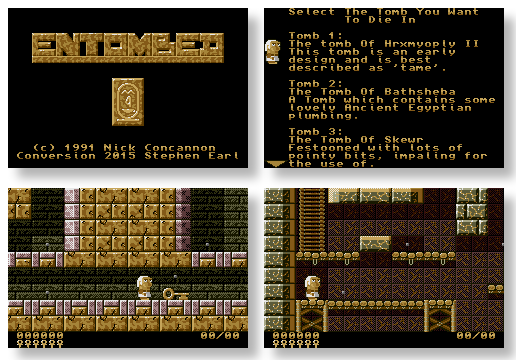

# Entombed

 * Original by Nick Concannon
 * GBA conversion by Stephen Earl

## Scenario

Being a master tomb builder gave Ya Salam many benefits - his own chariot
space at the quarry, immortalization after death, a mummified crocodile 
for the kitchen (return within 28 days if not completely satisfied) -
but it had one slight disadvantage, namely Ya Salam had to test the traps
and pitfalls in the tombs he made!

## Game

'Entombed' consists of five levels of platform fun so cunning you could dice
carrots with them. You can play the first four levels in any order you like -
or any order you dislike - but all four must be completed before you can try
level five. To select a level use the D-Pad to move Ya to the level you want
to try, then press A/Start.
The tombs contain nasty things, like spikes, fire, and boiling water (or it
could be sparkling Perrier, it's hard to tell). There are also useful objects
to collect, such as a bow, arrows, keys, and hourglasses. The latter are needed
to delay changes in the layout of the tombs. You can tell part of the tomb is
about to change when it starts to flicker, allowing you to see what it will
change into. While it's flickering it behaves like what it was before it
started to flicker, so don't walk into a set of flickering spikes thinking
it's safe.
Your objective on each level is simply to find the exit, which is a little
doorway with a sunset visible through it.


## Screenshots




## Gameplay

### Controls

 * D-Pad: Move/Climb/Jump
 * A: Shoot arrow
 * B: Hold to look down
 * L: Select number of seconds to use after collecting hourglasses
 * R: Use the currently selected number of seconds to delay tomb changes
 * Start: Pause/Unpause

While paused, hold Select then press Start to go back to the last checkpoint.
You will lose a life in the process, but it's handy if you somehow got stuck.

On the title screen:
Hold Select for 10 seconds then release. This will allow you to reset the high
score table.

### Tips

 1) Always assume it's a trap. It usually is.
 2) Make good use of your look down button. Danger often lurks below you.
 3) On level 1, the "ladder" of appearing blocks right after the first door
    can be overcome by holding up on the D-Pad after you successfully land on
    the first block.
 4) Arrows are precious. Do not waste them. 
 5) Don't give up! 


## Building

Install devkitARM, libtonc, grit, maxmod and gba-cmake. Easiest is with
```shell
# (dkp-)pacman -S gba-dev
```

Then use CMake to configure, build and package the project:
```shell
$ cmake -B builddir .
$ cmake --build builddir
$ cmake --build builddir --target package
```


## License

Unknown currently, Freeware assumed
